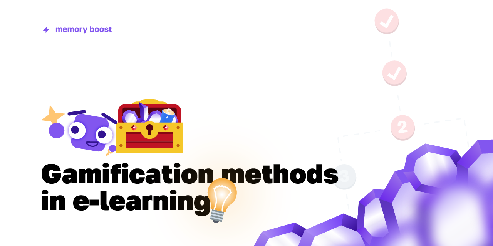

 

 
 

<h1 align="center">
    ✨ <code>Gamification in Memory Boost</code> ✨
</h1>

 

Memory Boost is an enormous learning platform, yet I needed to engage people to learn!

So, I think that <strong>the gamification is the way!</strong>

 
 

<code>Table of contents</code>

- [🎮 Concepts](#-concepts)
  - [💡 Streak](#-streak)
  - [🗺️ Exercise maps](#-exercise-maps)
  - [✨ Stars](#-stars)
  - [💎 Amethysts](#-amethysts)
- [🔬 Research & Scientific papers](#-research--scientific-papers)

 

## `🎮` `Concepts`
There are several concepts used in Memory Boost to engage people to learn, which were
actively used in project and demonstrated high efficiency of engagement.

### `💡` `Streak`
`💡 Streak` is a number of days a student solve puzzles on the platform without skipping
a day.

1. A new student starts with 0 day streak.
2. By solving an exercise or a puzzle, his/her streak increases by one.
3. To increase more, one should open the platform and solve an exercise tomorrow.
4. If one day is skipped, the streak is reset to 0 days.

### Why is it so motivating?
People care so much about their game statistics. And increasing the streak statistic
is straightforward and way too simple - just open the platform and solve just one 
problem, does not matter what problem one is going to solve though. It is enough
to solve any. It would be a bummer to lose a high streak, let's say 200 days, wouldn't it?

### What if students want to take a rest for a day or few?
By learning, they earn amethysts (learn about this here). They can spend some amethysts
to buy some `🔋 charges`. If a student skips one day, and they have a charge, the charge
is being used to save the streak. The streak stays the same, and the charge is taken.
But there's limited amount of charges one can purchase, only seven.

### `🗺️` `Exercise maps`
Exercises are hard to structure, there are a lot of topics to learn. And it may seem 
overwhelming for people to choose the starting topic. `🗺️ An exercise map` solve this problem:
they link related topics together making a roadmap with a defined start and finish points.
And here we keep the enchanting feeling of a game!

### `✨` `Stars`
`✨ Stars` is a metric showing how many exercises one solved. Let's say, there are 4 exercises in
a topic:

* `Exercise #1`: Gives **5 ✨**
* `Exercise #2`: Gives **5 ✨**
* `Exercise #3`: Gives **10 ✨**
* `Exercise #4`: Gives **20 ✨**

The 4th exercise is hard, so hard exercises are optional. To complete this topic, we sum up
the amount of stars of not-hard, required exercises: $`5 + 5 + 10 = 20`$. 

Stars cannot be spent to purchase something though. It only shows how many exercises one solved.

### `💎` `Amethysts`
`💎 Amethysts` is a in-game currency which can be earned by learning. To earn amethysts,
one have to solve some exercises. Amethysts can be spent to purchase stuff in the platform
shop to buy, for example, amethysts boosters or charges!

## `🔬` `Research & Scientific papers`
Before developing Memory Boost, I made some research about engagement on platforms: 

* Frolov A. A., Matunin E. Y. - [🧾 SUPPORTING STUDENT ENGAGEMENT IN MODERN ONLINE EDUCATION SYSTEMS](Research/Supporting-Student-Engagement-in-Modern-Online-Education-Systems.pdf): _Russian language only yet, pages 223-224_;
* Frolov A. A. - [🧾 AI-BASED CHEATING PREVENTION ON E-LEARNING PLATFORMS](Research/AI-Based-Cheating-Prevention-on-E-Learning-Platforms.pdf): _English language, pages 75-76_;

 
 
 
 

  &copy; Memory Boost 2019. All rights reserved.

 
 